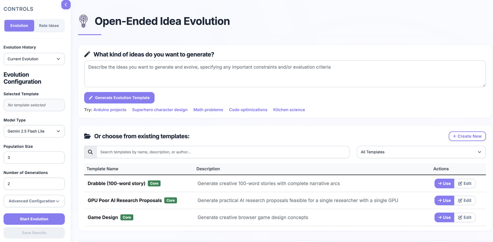
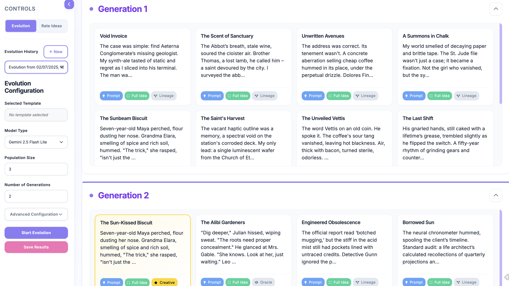
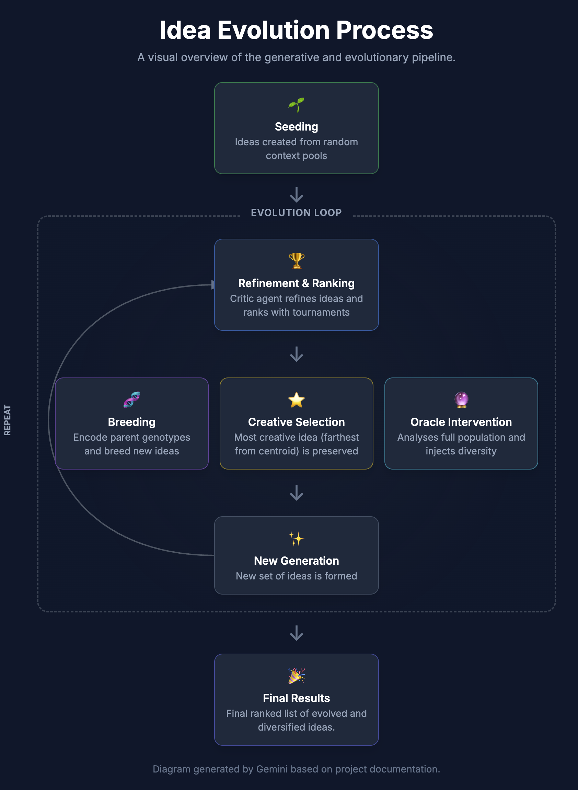

# Idea Evolution

Idea Evolution is a small web app that uses multiple LLM agents (Ideator, Critic, Breeder, Oracle) to generate, evolve, and rate ideas over several generations. You can run a full end‑to‑end evolution, visualize diversity, and rank ideas manually or automatically.





## What you can do

- Generate and evolve ideas with Gemini models (2.0 and 2.5 variants)
- Track population diversity over generations (embeddings‑based)
- Preserve the most creative idea across generations (creative selection)
- Rate ideas with an ELO‑style tournament (manual and automated)
- Create and edit YAML prompt templates in the UI
- Save/load evolutions and re‑rate them later

## Quickstart

1) Install dependencies

```bash
python -m venv .venv && source .venv/bin/activate
pip install -r requirements.txt
```

2) Configure your API key

```bash
export GEMINI_API_KEY=your_api_key_here
```

3) Run the app

```bash
uvicorn idea.viewer:app
```

4) Open the UI

- Evolution viewer/creator: http://localhost:8000/
- Idea rater: http://localhost:8000/rate

## A 1‑minute tour

- Pick a template (or generate a new one), choose model and population settings, then click Start Evolution.
- Watch ideas arrive plus a diversity chart for each generation.
- The Oracle periodically replaces the least interesting idea (closest to the centroid) to avoid convergence.
- The most creative idea (farthest from the centroid) is preserved into the next generation with a ⭐ marker.
- Use Save Results to snapshot an evolution; visit Rate Ideas to compare and rank saved runs (manual or automated; costs are estimated and shown).

See the explainer: `docs/EvolutionOverview.md`.

## Running tests

```bash
pytest -q
```

## Structure (high‑level)

- `idea/viewer.py` – FastAPI app serving the viewer, rater, and template APIs
- `idea/evolution.py` – Evolution engine, tournaments, creative/oracle selection, diversity tracking
- `idea/llm.py` – LLM wrapper and agents (Ideator, Formatter, Critic, Breeder, Oracle)
- `idea/prompts/` – YAML templates system, validation, loader, and Oracle prompt bundle
- `idea/static/` – Frontend HTML/CSS/JS (viewer and rater UIs)

## Templates

YAML templates live in `idea/prompts/templates/`.

- `airesearch.yaml` – GPU‑poor AI research proposals
- `game_design.yaml` – Browser game designs
- `drabble.yaml` – 100‑word stories

Create new templates from the UI (on the main page) or by adding YAML files. See `idea/prompts/templates/README.md` for the schema.

## Configuration tips

- Models and pricing are defined in `idea/config.py` and used to estimate token costs for evolution and auto‑rating.
- Gemini 2.5 models support an optional “thinking budget”; the UI enables this when applicable.

## Troubleshooting

- “GEMINI_API_KEY environment variable is not set” banner: export the key and restart the app.
- Empty diversity chart for “current evolution”: save the evolution and re‑open it from the list (see also known issue in `TODO.md`).

## Roadmap

See `TODO.md` for planned features, research ideas, and open bugs.
